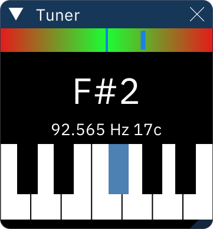

# tuner

the Tuner window shows the approximate frequency and note of the audio output.

the meter at the top shows how close the note is to center pitch.

the center displays the approximate note, followed by the calculated peak frequency in Hz and how far from center pitch it is in cents (hundredths of a semitone).

the piano keyboard shows the approximate note.