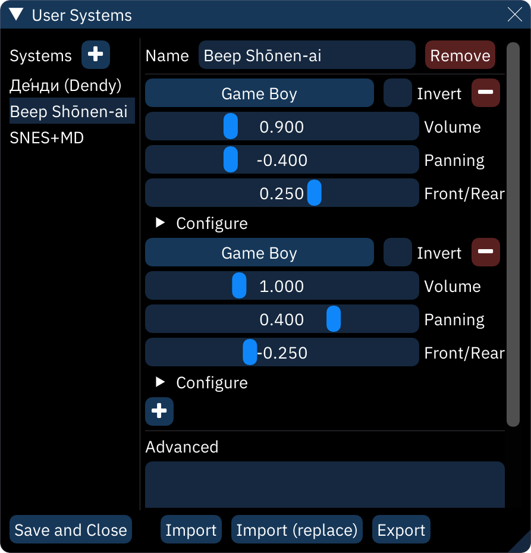

# user systems

combinations of chips and chip configurations can be stored as **user systems** – presets that are easily accessed when starting a new song.

the `+` button at the top of the **Systems** list will add a new system.

next to the **Name** field, the **Remove** button removes the current system from the list.

chip configuration is exactly as in the [chip manager](chip-manager.md) window.

the **Advanced** field stores additional settings that are set when a new song is started. these are listed in "option=value" format, one per line.
- `tickRate`: sets tick rate.
- `chanMask`: sets which channels to hide. written as a comma-separated list of integers

**Save and Close**: as it says.

**Import**: opens a dialog to select a `.cfgu` file, then adds its systems to the list.

**Import (replace)**: opens a similar dialog, then clears the existing systems list and replaces it with the imported one.

**Export**: stores the current list of systems in a selected `.cfgu` file.