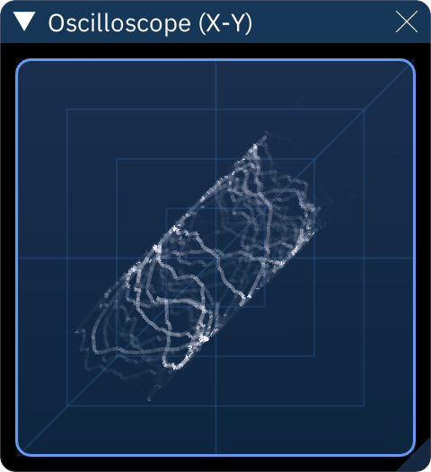

# oscilloscope (X-Y)

also called "vectorscope", this is similar to the normal oscilloscope in that it draws audio output as a waveform, but instead of being one-dimensional and going from left to right, it is plotted in two dimensions (usually X represents left output and Y represents right output).

right-clicking the X-Y oscilloscope window displays settings:
- **X Channel**: the output channel which will affect the X (horizontal) axis. default is 1 (left).
  - **Invert**: flips the axis, therefore flipping the view horizontally.
- **Y Channel**: the output channel which will affect the Y (vertical) axis. default is 2 (right).
  - **Invert**: flips the axis, therefore flipping the view vertically.
- **Zoom**: changes amplitude, making the plot bigger or smaller.
- **Samples**: the maximum number of samples to use for plotting.
  - this setting may be replaced by another or removed in a future version.
- **Decay Time (ms)**: sets how long it takes for the points/lines to fade away.
- **Intensity**: changes the brightness of the dots/lines.
- **Line Thickness**: sets how thick lines are.

click **OK** to return to the oscilloscope view.
