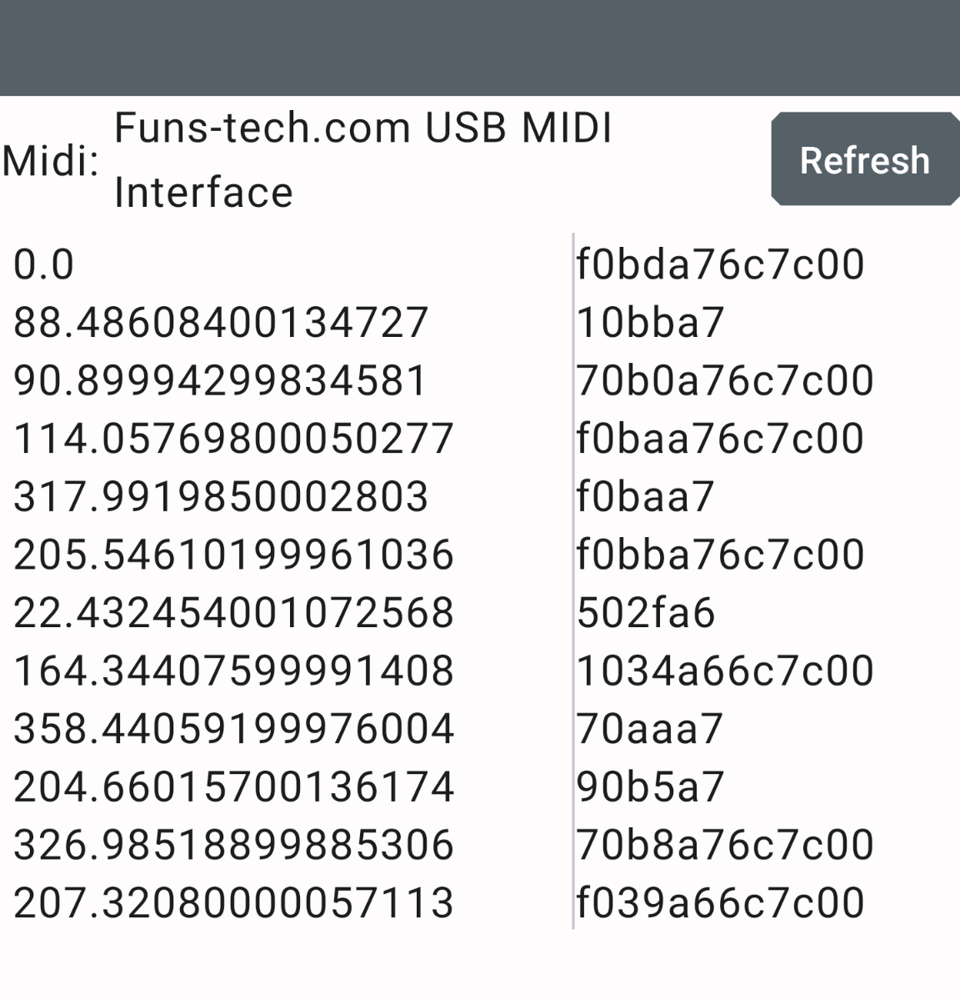

# Example Android Studio project 

Simple app using RtMidi. There are symlinks to 3 files in the main RtMidi project
* RtMidi.cpp
* RdMidi.h
* MidiDeviceOpenedListener.java

The main goal of this project is to demonstrate how to build RtMidi into an Android app. The
app itself simply lists midi devices, opens the selected port and prints out any incoming packet

